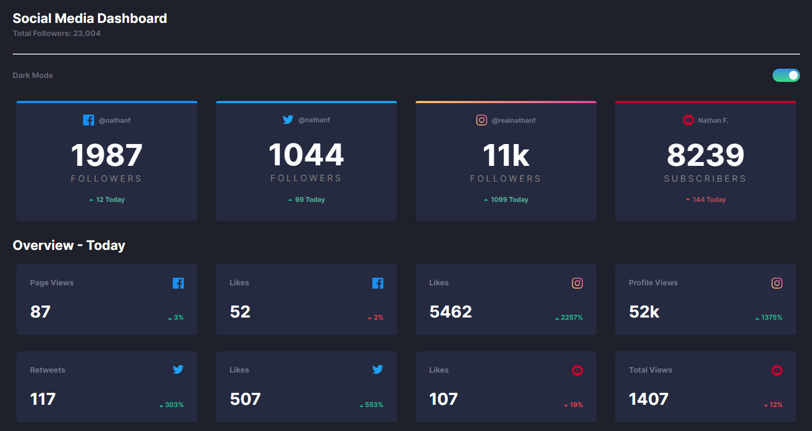

# Frontend Mentor - Social media dashboard with theme switcher solution

This is a solution to the [Social media dashboard with theme switcher challenge on Frontend Mentor](https://www.frontendmentor.io/challenges/social-media-dashboard-with-theme-switcher-6oY8ozp_H). Frontend Mentor challenges help you improve your coding skills by building realistic projects. 

## Table of contents

- [Overview](#overview)
  - [The challenge](#the-challenge)
  - [Screenshot](#screenshot)
  - [Links](#links)
- [My process](#my-process)
  - [Built with](#built-with)
  - [What I learned](#what-i-learned)
  - [Useful resources](#useful-resources)
- [Author](#author)

## Overview

### The challenge

Users should be able to:

- View the optimal layout for the site depending on their device's screen size
- See hover states for all interactive elements on the page
- Toggle color theme to their preference

### Screenshot



### Links

- Live Site URL: [https://social-media-dashboard-with-theme-switcher-self-seven.vercel.app/](https://social-media-dashboard-with-theme-switcher-self-seven.vercel.app/)

## My process

### Built with

- Semantic HTML5 markup
- CSS custom properties
- Flexbox
- Mobile-first workflow

### What I learned

```html
<div class="color-theme">
  <p>Dark Mode</p>
  <div class="toggle-switch" id="checkbox">
    <label>
      <input type="checkbox">
      <span class="slider"></span>
    </label>
  </div>
</div>
```
```css
body.dark {
  transition: 1.0s;
  background-color: hsl(230, 17%, 14%);
}

body.dark h2,
body.dark h3 {
  color: hsl(0, 0%, 100%);
}

body.dark .facebook-container,
body.dark .instagram-container,
body.dark .twitter-container,
body.dark .youtube-container,
body.dark .container{
  transition: 1.0s;
  background-color: hsl(228, 28%, 20%);
}

body.dark .followers-amount,
body.dark .metric-amount {
  color: white;
}

.facebook-container,
.twitter-container,
.instagram-container,
.youtube-container {
  display: flex;
  flex-direction: column;
  border-radius: 5px;
  background-color: hsl(222, 50%, 96%);
  text-align: center;
  justify-content: space-between;
  padding-bottom: 20px;
  width: 80%;
  height: 220px;
  margin-left: auto;
  margin-right: auto;
  margin-bottom: 10px;
  transition: 1.0s;
}
```

### Useful resources

- [Codecademy](https://www.codecademy.com/learn) 

## Author

- Frontend Mentor - [@Gathrik](https://www.frontendmentor.io/profile/Gathrik)
- GitHub - [@Gathrik](https://github.com/Gathrik)

